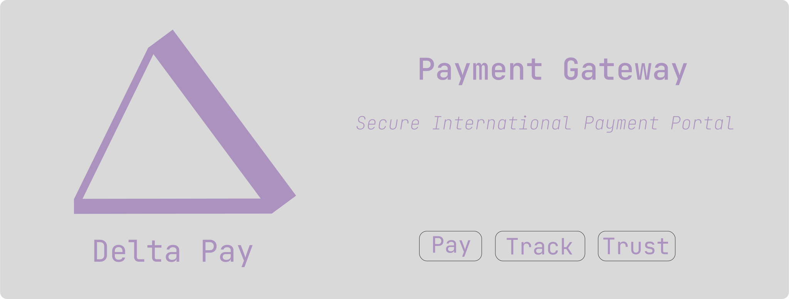

  

Delta pay is a mockup of an international payment solution. It features multiple security features and data security layers with a clean and structured layout. 

## Access Control & User Roles

Delta Pay implements a role-based access control system with two distinct user types:

### Customer Users
- **Access:** Payment portal only (customer-facing interface)
- **Authentication:** Username, account number, and password (PBKDF2-hashed with 100,000 iterations)
- **Capabilities:** 
  - Make international payments
  - Enter payment details and recipient information
  - Submit transactions for employee verification
- **Restrictions:** Cannot access the admin/backend portal

### Employee/Administrator Users
- **Access:** Backend/admin portal only
- **Registration:** Pre-registered in the system when employed (no self-registration)
- **Authentication:** Employee credentials with role verification
- **Capabilities:**
  - View all pending payment transactions
  - Approve or deny customer payments
  - Create new customer accounts via the "Create User" feature
  - Monitor security logs and suspicious activities
  - Track user behavior and IP addresses
  - Manage account lockouts and security events
- **Restrictions:** Dedicated employee interface separate from customer portal

> **Security Note:** In production, access to the backend/admin view is strictly enforced through authentication middleware, role-based session tokens, and CSRF protection. Regular customers will never see or be able to access administrative functions. 

## UI Structure

### General Layout:
- Delta Pay logo in the top right corner of the page.
- text next to logo.
- text color for logo is #AB92BF while outline of the top bar is #655A7C
- any additional elements can either be #8da8c7ff or #CEF9F2
- background doesn't have to be white or black, can be either one of these colours mostly the purple ones
- Interfaces must be up to standard for both mobile and desktop views

### Landing page
- The landing page has 2 options: **Backend View** (Admin Only) and **Payment View** (Customer Portal)

> **Note:** The Backend View is restricted to administrators only. In production, regular users will not be able to access this view. Access control is enforced through role-based authentication and session management.

### Payment page
- The top right of the page displays a user icon with the first letter of the person's name
- **User Selection Flow (from Landing Page):**
  1. When navigating from landing page to payment view, user must first select one of the available user accounts (not bank accounts)
  2. After account selection, a custom (non-browser) popup prompts for password authentication
  3. Password is validated using the same Argon2/PBKDF2 hashing and salting as backend security features
  4. Only after successful authentication is the payment page displayed
- **Payment Interface:**
  - Standard payment gateway inputs with appropriate field masking for sensitive data (card numbers, CVV, etc.)
  - Multi-currency support with currency selection
  - SWIFT provider selection for international transfers
  - Account information and SWIFT code entry fields
  - All features expected from a modern, secure payment gateway
- **User Experience:**
  - Clean, smooth animations that don't overwhelm the user
  - Modern, secure visual design language
  - Upon clicking submit, a clean animated prompt appears with a checkmark/tick animation confirming "Payment Sent"
- Apply general layout formatting

### Backend view (Admin Portal - Access Restricted)
**Access Control:** This view is exclusively for pre-registered bank employees/administrators. Regular customers cannot access this portal in production. Authentication is enforced with employee-only credentials and role-based session tokens.

#### Features:
- **Payment Management:** View all pending international payments from customers and approve or deny them before forwarding to SWIFT
- **User Management:** Access the "Create User" feature to register new customer accounts
- **Security Monitoring:** Comprehensive security log displaying:
  - Failed login attempts and account lockouts
  - Suspicious activities and exploit attempts
  - User navigation patterns with IP address tracking
  - Account access history and user tracking
  - All security events with severity levels (info, warning, error)

#### Create User Feature:
The admin portal includes a comprehensive user registration system (`CreateUser.html`) that allows administrators to create new customer accounts. This feature includes:

**Personal Information:**
- Full name (letters only, 2-50 characters)
- ID number (13 digits)
- Date of birth (DD/MM/YYYY format)
- Nationality and occupation

**Account Details:**
- Username (3-20 alphanumeric characters)
- Account number (10-20 digits, auto-formatted)
- Password with real-time strength validation (minimum: Strong - 5/6 criteria)
  - Must include: lowercase, uppercase, number, special character
  - Minimum 8 characters (12+ recommended for "Very Strong")
- Account type (Standard/Premium/Business)
- Initial balance and annual income
- Multi-currency support (ZAR, USD, EUR, GBP, AUD, CAD, CHF, JPY)

**Contact Information:**
- Email address and phone number (international format: +XX-XX-XXX-XXXX)
- Full address (street, city, state/province, postal code, country)
- Preferred language

**Payment Card Information:**
- Card number (16 digits, auto-formatted with spaces)
- Card expiry (MM/YY format)
- Cardholder name (auto-fills from full name)

**Security Features:**
- Real-time input validation with RegEx whitelisting
- Password strength meter with visual feedback (Weak → Very Strong)
- Password visibility toggle for both password fields
- Submit button disabled until password meets minimum strength (Strong)
- All sensitive data is hashed with PBKDF2 (100,000 iterations) before storage
- Comprehensive error handling and user feedback via toast notifications
- CSRF token protection on form submission

> **Important:** Customer self-registration is not available. All user accounts must be created by administrators through this secure interface to ensure proper verification and compliance with banking regulations. 

## Frontend Technologies

- React - Customer and employee portals
- JSON Web Tokens (JWT) - Authentication
- HTTPS/TLS 1.3 - Transport security
- Content Security Policy (CSP) - [XSS attacks]
- X-Frame-Options: DENY - [Clickjacking]
- HttpOnly, Secure, SameSite=Strict cookies - [Session hijacking]

## Backend Technologies

- Deno - API runtime (port 3623 for main app)
- Argon2 - Password hashing/salting
- Regular Expressions (RegEx) - Input whitelisting
- Parameterised queries - [SQL injection]
- CSRF tokens - [Cross-Site Request Forgery]
- Rate limiting - [Brute force attacks]
- Database - SQLite (Not ideal for this use case, but simplifies it)

## Security Infrastructure

- Cloudflare - [DDoS attacks] (Implement later)
- Cloudflare Tunnel - [MITM attacks] (Implement later)
- WAF (Web Application Firewall) - Application protection (Implement later)
- PCI DSS compliance - Payment security (Implement later)
- Tokenisation - Sensitive data protection

## DevSecOps Pipeline

- GitHub - Version control
- CircleCI - CI/CD pipeline (Implement later)
- SonarQube - Static code analysis (Implement later)
- ScoutSuite - Cloud security auditing (Implement later)

## Data Security

- Application-level encryption - Data at rest
- Database tokenisation - Payment data
- Structured JSON logging - Security monitoring
- Session token regeneration - [Session fixation]

## Additional Components

- SWIFT integration - International payments (not needed, it's a mockup)
- Multi-currency support - Currency handling (symbols)
- Pre-registered employee system - No registration required (give temp users)
- Transaction verification workflow - Employee approval process (admin page with employee approval)

## Assignment Topic

You work as a developer in the internal development team for an international bank. Your team is
working on the internal international payment system. Customers often must make international
payments via the bank’s online banking site. From here, the payments need to be displayed on the
payments portal, which is only accessible by dedicated pre-registered staff. Customers need to register for
the system by providing their full name, ID number, account number, and password. As you can
imagine, this is quite sensitive information that needs to be appropriately secured. After registering,
customers need to log on to the website by providing their username, account number and
password. Once logged on, the customer should be able to enter the amount they need to pay,
choose the relevant currency and choose a provider to make the payment. In South Africa, we
mainly make use of SWIFT. They will next be prompted for the account information and SWIFT code
for which they wish the payment to be made. The customer will finalise their process by clicking on
Pay Now.
From here, the transaction should be stored in a secure database and appear on the international
payments portal. Employees of the bank are pre-registered on the portal when they are employed.
No registration is necessary; however, they do need to log on to the system to check transactions
and forward them to SWIFT for payment. This is done by checking the payee's account information
and verifying that the SWIFT code is correct. The employees complete the transaction by clicking a
verified button next to each entry and finally by clicking submit to SWIFT – your job ends when that
button is clicked. 
